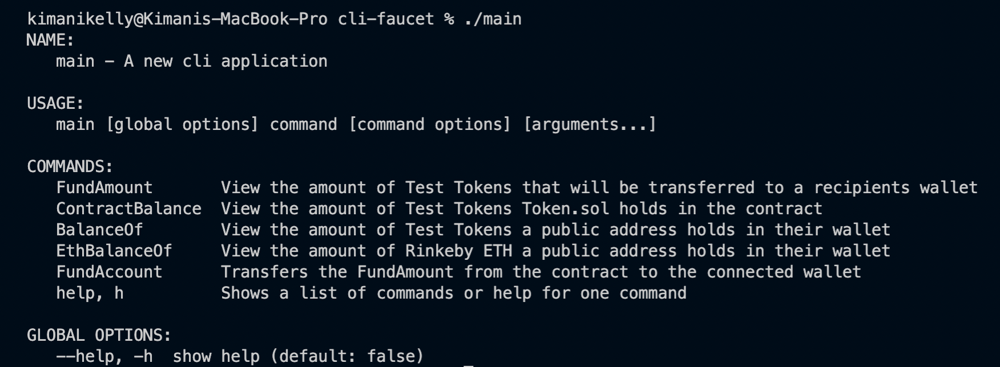

# cli-faucet

[](https://github.com/kimanikelly/cli-faucet/actions/workflows/go.yml)

## Token.sol on Etherscan ( Rinkeby Testnet)

- https://rinkeby.etherscan.io/address/0x1f3839dde4c058dfb8989b9d341491905fb46ddd

## Token.sol Source Code

- https://github.com/kimanikelly/contracts/blob/main/contracts/Token.sol

## Installation & Setup

### Git clone the repository

```
git clone https://github.com/kimanikelly/cli-faucet.git
```

### Create a `.env` file for the environment variables.

```
touch .env
```

### Set the environment variables by using the [.env.example](https://github.com/kimanikelly/cli-faucet/blob/main/.env.example) file as a reference.

- Set the `RINKEBY_URL` to your valid Infura Rinkeby provider node.

- Set the `PRIVATE_KEY` to your valid Ethereum Wallet private key.

- Set the `ENVIRONMENT` to the string Rinkeby.

## CLI Commands

### Verify installation & setup with the `./main` executable.

Run the command

```
./main
```



### View the amount of TEST TOKENS a connected wallet will receive.

Run the command

```
./main FundAmount
```


### View the amount of TEST TOKENS Token.sol holds in the contract.

```
./main ContractBalance
```


