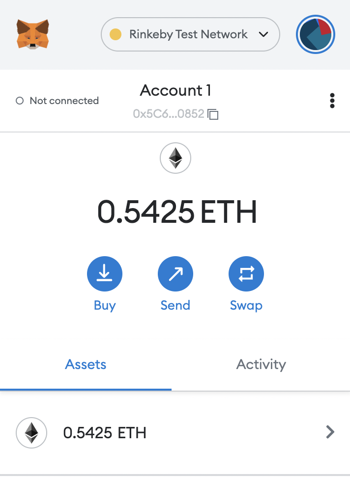

## View your TEST TOKEN wallet amount after the FundAccount command is called

Token.sol Address (Rinkeby Testnet)

```
0x1F3839Dde4C058DfB8989b9D341491905FB46ddD
```

### Open MetaMask and switch to Rinkeby Testnet in the browser



### Locate the Import tokens link

Click on the Import tokens link


Input the Token.sol address and Add Custom Token


TEST TOKEN will populate in the wallet and show your current balance


